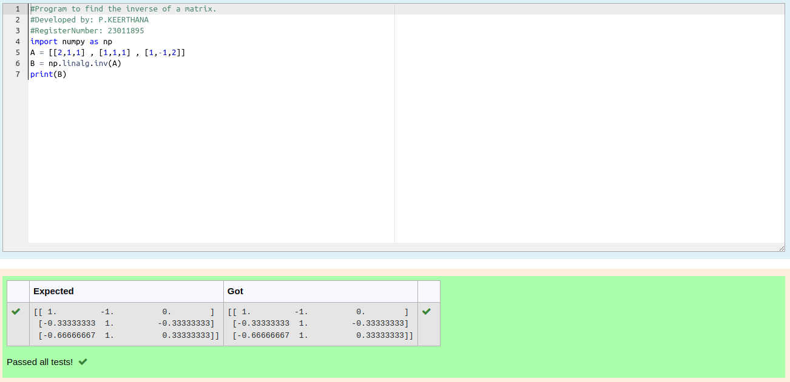

# INVERSE-OF-A-MATRIX
## Aim:
To write a python program to find the inverse of a matrix
## Equipment’s required:
1. 	Hardware – PCs
2. 	Anaconda – Python 3.7 Installation / Moodle-Code Runner
## Algorithm:
### Step1 : 
Start the Program
### Step 2: 
Enter the code appropriately
### Step 3: 
Run the Program
### Step 4: 
End the program
## Program:
```
#Program to find the inverse of a matrix.
#Developed by: P.KEERTHANA
#RegisterNumber: 23011895
import numpy as np
A = [[2,1,1] , [1,1,1] , [1,-1,2]]
B = np.linalg.inv(A)
print(B)
```
## Output:

## Result:
Thus the inverse of given matrix is successfully solved using python program

